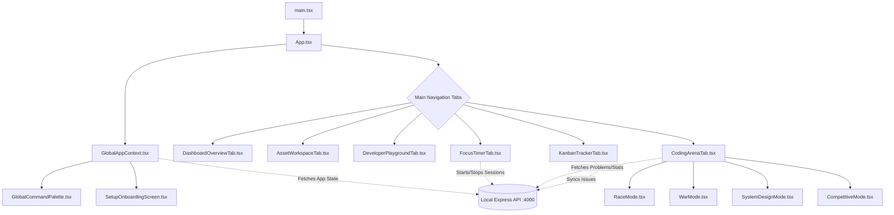

# DevOS / Dev-Flow Developer Manual

Welcome to the DevOS developer manual. This document is a comprehensive guide to understanding the architecture, module connections, UI/UX philosophy, and intended purpose of the DevOS application. It is designed to rapidly onboard developers and AI agents, providing a "god's-eye view" of how everything connects.

## 1. Intended Purpose
DevOS is an all-in-one developer productivity, analytics, and training dashboard. It consolidates workflow elements that developers typically scatter across multiple apps into a unified, visually stunning desktop experience (packaged via Electron).

Core functionalities include:
- **Dashboard & Analytics:** Real-time metrics on coding time, commits, lines of code, and flow states.
- **Coding Arena:** A competitive/practice environment featuring Speed Races, Concept Wars, System Design whiteboarding, and a LeetCode-integrated competitive mode.
- **Focus & Flow:** A timer mechanism to track deep work sessions and manage distractions.
- **Kanban & Issue Tracking:** Integrated task management (syncs with external tools like Linear).
- **Playground & Workspaces:** Sandboxes and asset management for rapid prototyping.

## 2. Architecture & Data Flow Diagram

The application follows a standard React Context-driven architecture with a flat module hierarchy for rapid feature iteration.

## 3. Technology Stack & Build System

- **Framework:** React + TypeScript running on Vite.
- **Build Tool:** Vite (running via `bun run dev` or `bun run build`).
- **Styling:** Tailwind CSS + Vanilla CSS (`index.css` for custom scrollbars and base layers).
- **Animations:** Framer Motion.
- **Icons:** Lucide React.
- **Charts/Data Vis:** Recharts (AreaChart, PieChart, RadarChart).
- **Desktop Wrapper:** Electron (loads the Vite localhost during development, and the static dist for production).

### How the Build Works
The project uses `bun` for package management and script execution. 
- During development, `bun run dev` starts the Vite HMR server. 
- For production, `bun run build` transpiles TS to JS and bundles everything into the `dist/` folder via Rollup (under the hood of Vite). Electron then points to this static bundle.

## 4. UI/UX Style & Animation Philosophy

The app employs a highly premium, modern, "Glassmorphism" aesthetic. When contributing to the UI, adhere to these guidelines:

### Visual Language
- **Glassmorphism:** Heavy use of `backdrop-blur-*`, translucent backgrounds (`bg-white/5` or `bg-slate-900/40`), and subtle borders (`border-white/10`).
- **Colors:** Deep dark mode base (`#0f0e13` or slate-950) accentuated by vibrant, highly saturated glowing colors (Violet for primary actions, Emerald for success/solved, Amber for medium/warnings, Rose for hard/errors).
- **Glows & Shadows:** Use radial gradients and drop shadows to create depth. You'll frequently see inline styles like `backgroundImage: "radial-gradient(...)"` or Tailwind utilities like `shadow-[0_0_30px_rgba(139,92,246,0.15)]`.

### Animation Style (Framer Motion)
Animations should feel fluid, springy, and responsive. 
- **Page Transitions:** Use `<AnimatePresence mode="wait">` to fade/slide tabs in and out. Standard entry is `initial={{ opacity: 0, y: 15 }}`.
- **Micro-interactions:** Buttons and cards should react to hover and tap.
  - `whileHover={{ scale: 1.02 }}`
  - `whileTap={{ scale: 0.98 }}`
- **Staggering:** Lists and grids should stagger their children's entrance (`transition: { staggerChildren: 0.05 }`).

## 5. Separation of Logic & Module Breakdown

To avoid a monolithic architecture, the app splits logic across contextual bounds.

### State Management
- **`src/context/GlobalAppContext.tsx`:** This is the single source of truth for global state. It handles the initial fetch of user settings, practice history, system status, and git statistics from the local backend. It exports a `useGlobalApp()` hook.
- **Local Component State:** Specific interactions (e.g., typing in a search bar, modal toggles, dragging issues) are handled locally via `useState` inside the specific view/tab component.

### Directory Structure & Where to Find What

| Directory / File | Description |
|---|---|
| `src/components/views/*` | **The core structural tabs of the app.** If you are adding a new feature panel, it likely belongs as a sub-component here. |
| `src/components/ui/*` | **Reusable UI building blocks.** (e.g., `MetricCard.tsx`, `SectionHeader.tsx`, `ActivityHeatmapGrid.tsx`). Add highly reusable, stateless presentational components here. |
| `src/components/features/*` | **Complex, self-contained feature modules.** (e.g., `GlobalCommandPalette.tsx`, `SetupOnboardingScreen.tsx`). |
| `src/App.tsx` | **The App Shell.** Manages the top-level nav bar, the sidebar icons, and mounts the active tab from `components/views`. |
| `src/index.css` | **Global Styles.** Contains custom scrollbar overrides (`.custom-scrollbar`), animations, and root CSS variables. |
| `src/*Mode.tsx` | **Arena Specific Components.** (e.g., `CompetitiveMode.tsx`, `SystemDesignMode.tsx`). These are complex sub-routes belonging exclusively to the `CodingArenaTab`. |

### How Modules Call Each Other
1. `App.tsx` reads `activeTab` from `useGlobalApp()`.
2. Based on `activeTab`, `App.tsx` conditionally renders a view from `src/components/views/` (e.g., `<CodingArenaTab />`).
3. Inside the view, the component may read further state from `useGlobalApp()` to dictate its internal layout (e.g., `arenaTab` determines whether `<RaceMode />` or `<CompetitiveMode />` is shown).
4. Sub-components manage their own data fetching or mutations directly to the local backend (port 4000) using native `fetch()`, maintaining independence from the global context for highly specific actions (e.g., submitting a solution in `CompetitiveMode`).

---
*End of Developer Manual*
